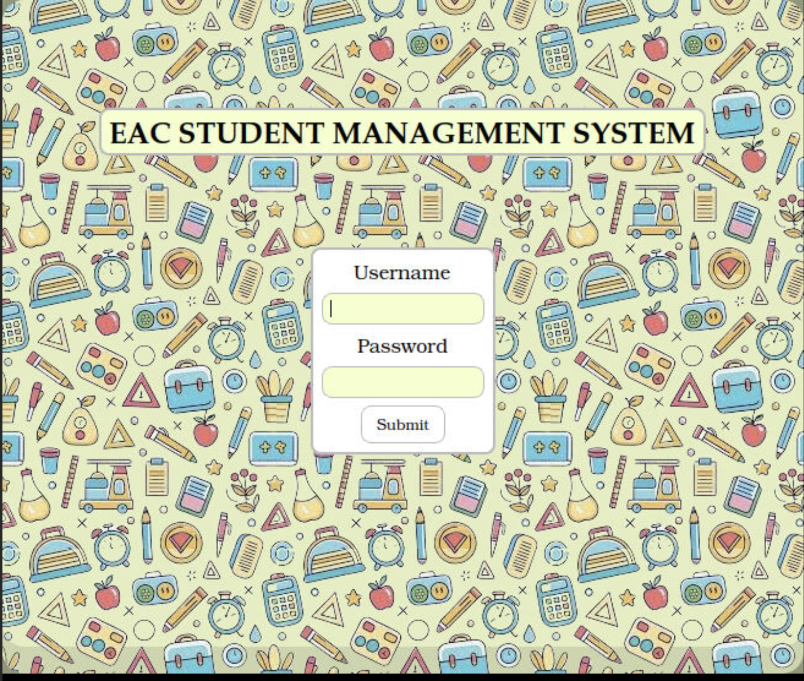
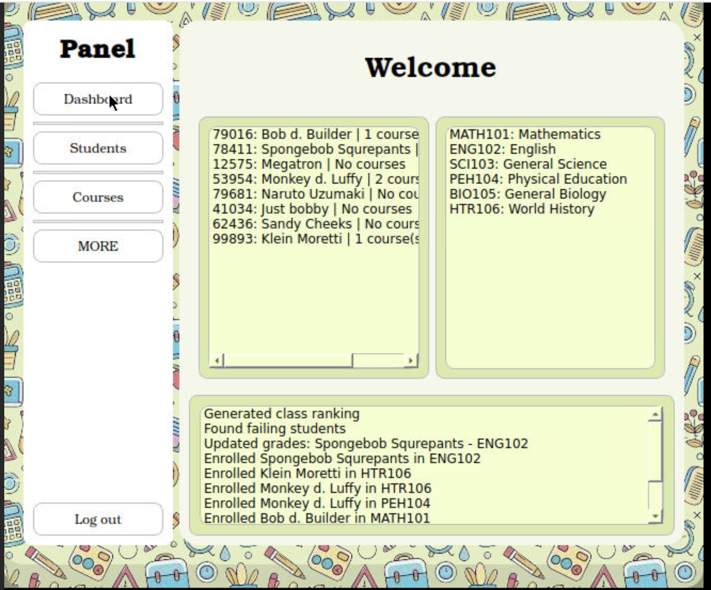
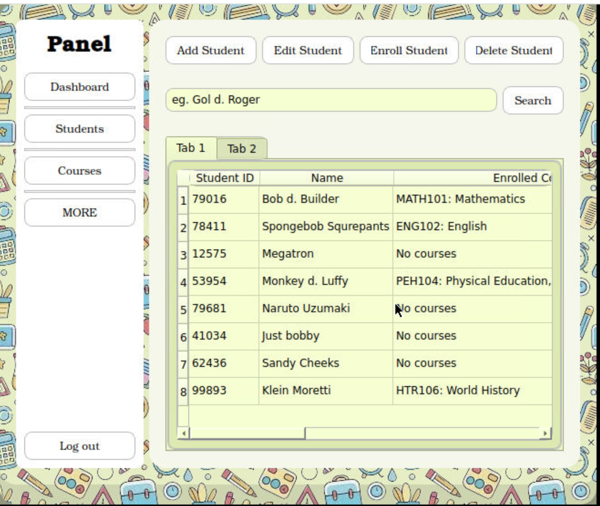
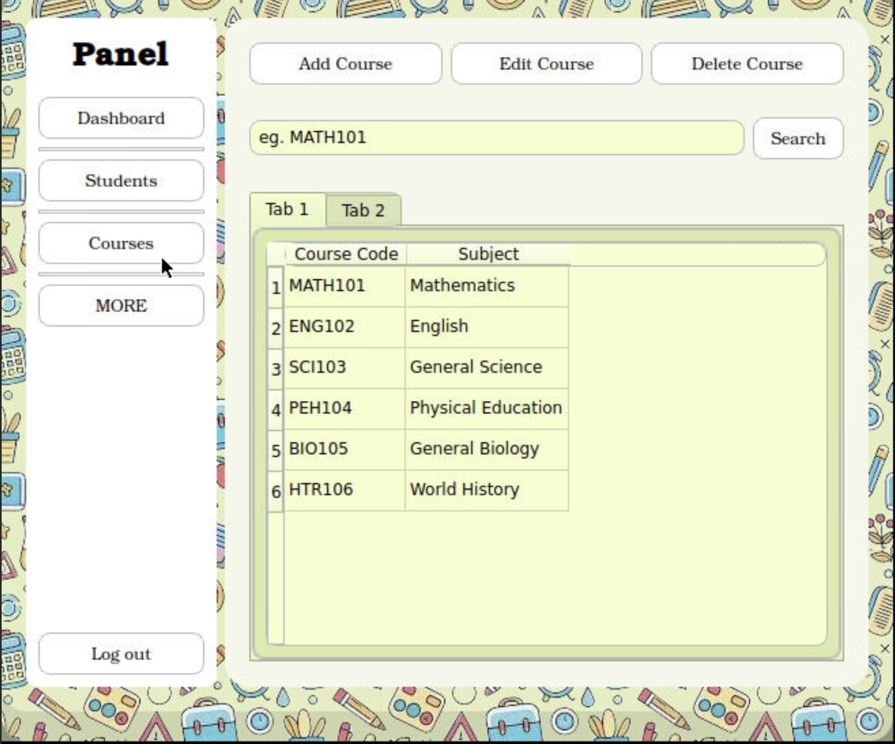
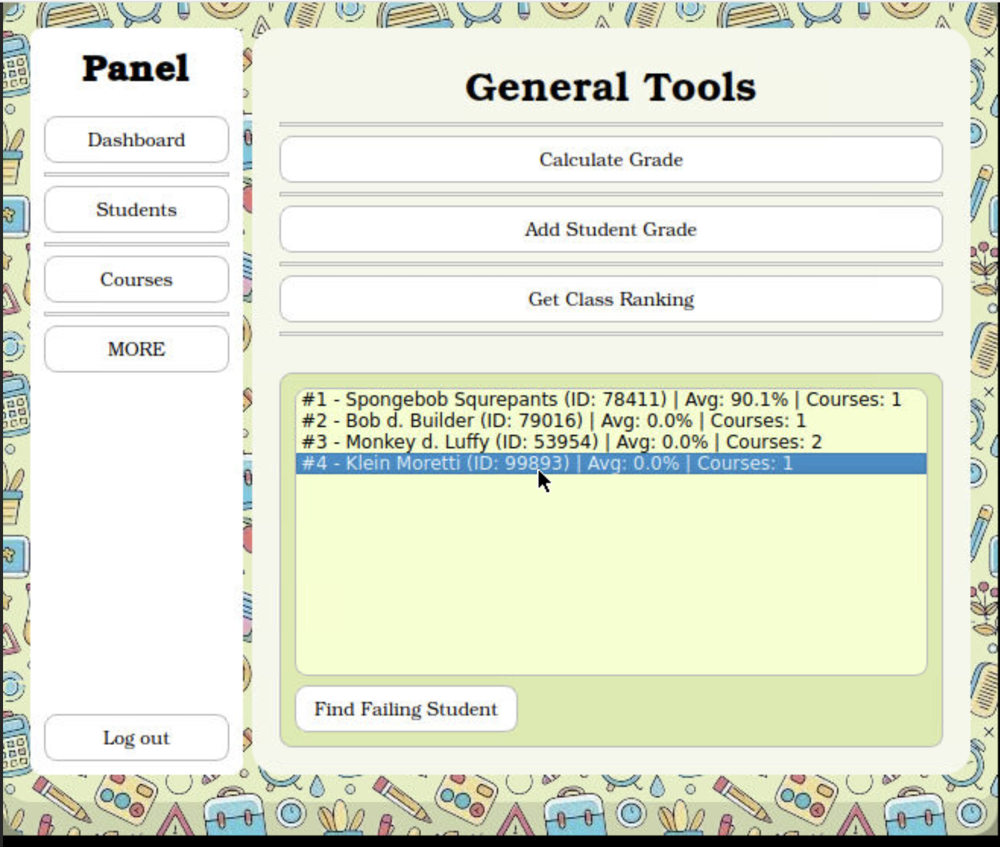

# Student Management System

A desktop application built with PyQt6 for managing student records, courses, grades, and generating academic reports. Created as a learning project for my Discrete Structures course to understand GUI development and event-driven programming.

## Features

### Student Management
- [x] Add, edit, and delete students
- [x] Assign unique student IDs automatically
- [x] Search students by ID or name
- [x] Enroll students in courses
- [x] Track enrolled courses per student

### Course Management
- [x] Add, edit, and delete courses
- [x] Unique course codes with validation
- [x] Search courses by code or subject
- [x] View enrolled students per course

### Grading System
- [x] Add grades for students (seatwork, assignments, quizzes, exams)
- [x] Automatic grade calculation with weighted system:
  - Class Standing (40%): Seatwork (25%) + Assignment (25%) + Quizzes (50%)
  - Final Grade: Class Standing (40%) + Exam (60%)
- [x] Pass/Fail determination (75% passing grade)
- [x] Grade calculator tool for quick calculations

### Reports & Analytics
- [x] Student academic reports (all courses and grades)
- [x] Course reports (all enrolled students)
- [x] Class ranking by average grade
- [x] Failing students identification
- [x] Recent activity tracking (last 10 actions)

### User Interface
- [x] Responsive design with QStackedWidget navigation
- [x] Multi-screen layout (Dashboard, Students, Courses, Tools)
- [x] Table and list views for data display
- [x] Custom dialog boxes for user input
- [x] Real-time feedback with message boxes

## Tech Stack

- **Language:** Python 3.x
- **GUI Framework:** PyQt6
- **Data Storage:** In-memory (dictionaries)

## Installation

### Prerequisites
- Python 3.8 or higher
- PyQt6

### Setup

1. Clone the repository:
```bash
git clone https://github.com/Be1l-ai/Student_Management.git
cd Student_Management
```

2. Install dependencies:
```bash
pip install -r requirements.txt
```

3. Run the application:
```bash
python main.py
```

## Usage

### Login
- **Username:** `admin`
- **Password:** `admin123`

*(Note: This is a learning project - authentication is intentionally simple)*

### Navigation
The application has 4 main sections accessible from the sidebar:
1. **Dashboard** - Overview with recent activity list
2. **Students** - Student management (add, edit, delete, search, enroll, student reports)
3. **Courses** - Course management (add, edit, delete, search, course reports)
4. **More** - Additional tools (grade calculator, rankings, failing students report)

### Typical Workflow
1. **Add courses** (e.g., "CS101 - Data Structures", "MATH101 - Calculus")
2. **Add students** (system generates unique IDs)
3. **Enroll students** in courses
4. **Add grades** for each enrolled course
5. **Generate reports** or view class rankings

## Project Structure

```
StudentManagementSystem/
├── main.py                    # Main application entry point
├── utils/
│   ├── student_management.py # UI file (Qt Designer generated)
│   ├── dialog_helper.py      # Custom dialog utilities
│   └── displaymanager.py     # Display utilities for tables/lists
├── ui/                       # .ui files
├── assets/                  
├── requirements.txt          # Python dependencies
├── screenshots/              # Application screenshots
└── README.md                # This file
```

## Code Architecture

### Helper Classes
- **DialogHelper:** Handles all user input dialogs (add, edit, search)
- **DisplayManager:** Manages data display in tables and lists
- **Validation methods:** Input validation (IDs, grades, course codes)

### Data Structure
```python
students = {
    student_id: {
        'name': str,
        'courses': [
            {
                'code': str,
                'subject': str,
                'grades': {'seatwork': float, 'assignment': float, ...},
                'remarks': str
            }
        ]
    }
}

courses = {
    course_code: {
        'course': str,
        'subject': str
    }
}
```

## Screenshots

### Login Screen


### Dashboard with Recent Activity


### Student Management Page


### Courses Management Page


### Class Ranking


## What I Learned

Building this project taught me:
- **PyQt6 fundamentals:** Widgets, layouts, signals/slots, event handling
- **QStackedWidget:** Multi-screen navigation in desktop apps
- **Event-driven programming:** Connecting UI actions to backend logic
- **State management:** Managing application data without a database
- **Input validation:** Ensuring data integrity with proper error handling
- **User experience design:** Confirmation dialogs, clear error messages, intuitive navigation
- **Code organization:** Separating UI logic from business logic with helper classes
- **Table/List widgets:** Displaying and updating data dynamically

## Known Limitations

- **No data persistence:** All data is lost when the application closes, No database integration
- **Basic authentication:** Hardcoded credentials (this is a learning project, not production software)
- **No multi-user support:** Single admin account
- **No export functionality:** Reports are displayed in-app only
- **Limited input sanitization:** Basic validation but no advanced security measures

## Future Improvements

If I continue this project, I'd add:
- [ ] SQLite database for data persistence
- [ ] Export reports to PDF/CSV
- [ ] Import student data from Excel/CSV
- [ ] Student profile pictures
- [ ] Course prerequisites system
- [ ] Attendance tracking
- [ ] Grade history and trends
- [ ] Email notifications for failing students
- [ ] Multi-user support with roles (admin, teacher, student)
- [ ] Proper authentication with password hashing

## Development Notes

This project was built as an assignment for my Discrete Structures course. The main learning goals were:
- Understanding GUI development with PyQt6
- Creating responsive layouts with QStackedWidget
- Implementing CRUD operations without a database
- Building a usable interface for managing relational data

## Running the Application

1. Make sure PyQt6 is installed
2. Run `python main.py`
3. Login with default credentials
4. Start by adding courses, then students, then enrolling and grading

**Built with PyQt6 for academic learning.**

**Assignment project for Discrete Structures course - demonstrating GUI development skills.**